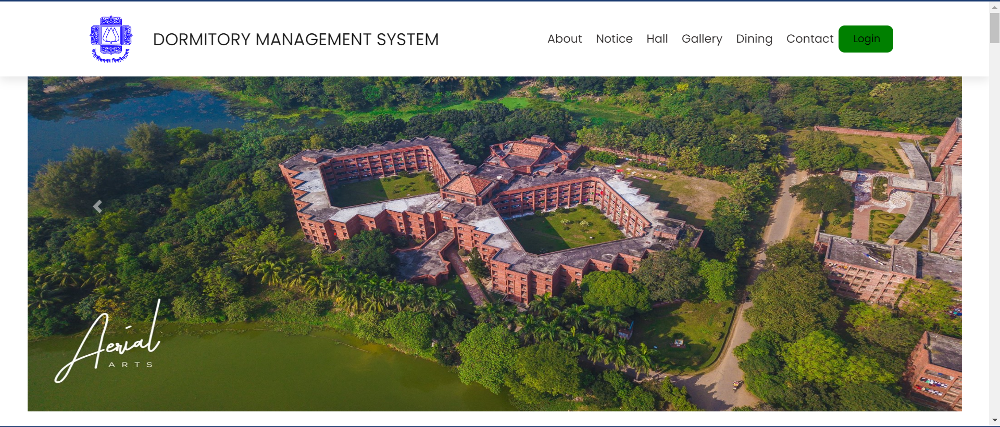
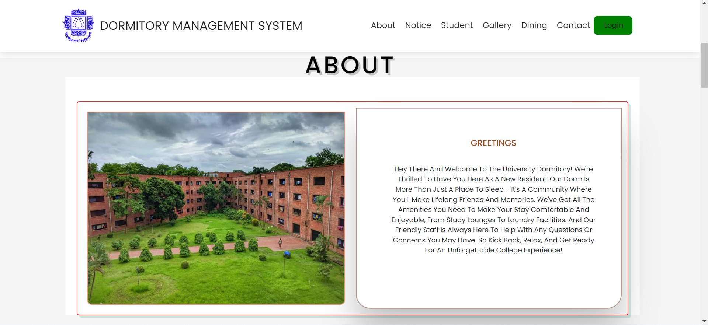
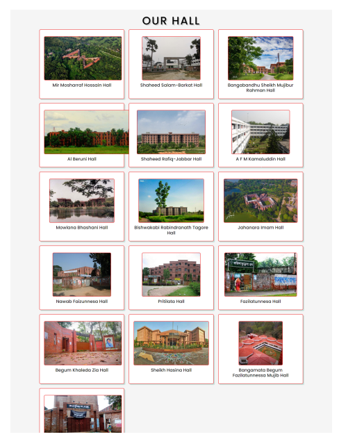
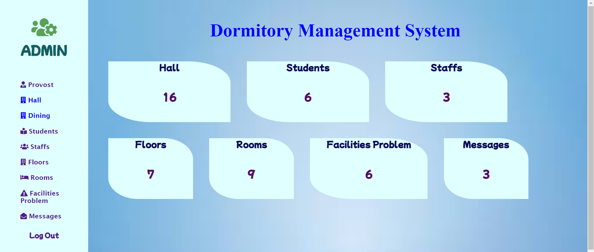

# SD-3101 Dormitory Management System



## Table of Contents
- [Introduction](#introduction)
- [Project Overview](#project-overview)
- [Objectives](#objectives)
- [Features](#features)
- [Technologies Used](#technologies-used)
- [Setup and Installation](#setup-and-installation)
- [Usage Instructions](#usage-instructions)
- [Project Structure](#project-structure)
- [Contributors](#contributors)
- [Chagelog](#changelog)
- [Acknowledgments](#acknowledgments)
- [License](#license)

---

## Introduction
The Dormitory Management System is designed to enhance the management of student dormitories by streamlining various tasks such as room assignments, occupancy tracking, and payment processing. It aims to reduce administrative workload, improve communication between students and administrators, and increase overall efficiency in managing housing facilities.

## Project Overview
The system was developed as a website that automates dormitory management processes. Key features include user registration and login, room assignment management, and billing integration. The project emphasizes ease of use, reliability, and scalability, ensuring it can grow with future needs and easily integrate with other campus systems.

## Objectives
The objectives of the “Dormitory Management System” are:
- To provide a digital management system for JU hall.
- To develop a user-friendly and intuitive website for dormitory management that can be accessed and utilized by both students and administrators.
- To improve the efficiency of managing dormitories by providing automated tools for managing room assignments, occupancy records, and billing and payment processing.
- Reduce paperwork and administrative burden by providing a digital platform for managing dormitories.
- To provide accurate and up-to-date information on dormitory occupancy, room assignments, and billing and payment information.
- To ensure the security and confidentiality of student and administrator data by implementing robust security measures.
- To provide a reliable and scalable system that can accommodate future growth and expansion.
- To improve the overall student experience by providing a streamlined and efficient process for managing dormitories.

## Features
Main features of the project:
- Admin Module: Manages dormitory-related administrative tasks.
- User Module: Allows students to view and manage their housing information.
- Room Assignment: Facilitates room allocations and updates occupancy records.
- Billing & Payment: Automates the tracking and processing of dormitory fees.

## Technologies Used
Tools, frameworks, and technologies used in the project:
- Frontend: HTML, CSS
- Backend: PHP
- Database: MySQL

## Setup and Installation
Step-by-step instructions for setting up the project locally.

1. **Clone the repository:**
  
   git clone git https://github.com/shakiliitju/Dormitory-Management-System/tree/master

2. **Set up the environment:**
	- Download and install XAMPP
  - Open the XAMPP and start Apache and MySQL services

3. **Database Setup**:
   - Import the provided database SQL file into phpMyAdmin.
   - Name the databasename DMS
   - Open the config.php file and update the database name:
  ```php
   &db = "DMS"
   ```
   - Clear any password in config.php by setting the password empty string
   ```php
   &db = ""
   ```

4. **Run the project:**
   - Move the project file in htdocs folder in XAMPP directory
   - Access the site by typing http://localhost/DormitoryManagement-System-master/DMS/

**Note:** If your project has external depencies like XAMPP, MySQL, special SDK, or other environemnt setup, create another section for it.

## Usage Instructions
Detailed instructions on how to use the project after setup:
- Admin Login:
  - Email: admin
  - Password: admin

## Design
- Home Page


- About Page


- Hall Page


- Admin Home Page


## Project Structure
Structure of the project directory. 
```bash
.
└── Dormitory-Management-System-master/
    ├── Design/
    │   ├── about.png
    │   ├── admin home.png
    │   ├── hall.png
    │   └── home page.png
    ├── DMS/
    │   ├── dashboard
    │   ├── Database
    │   ├── Dining
    │   ├── FacilitiesProblem
    │   └── Floor
    ├── ER Diagram/
    │   ├── ER Diagram.drawio
    │   └── ER Diagram.drawio.png
    ├── Presentation/
    │   └── Group-8.pptx
    ├── Project Proposal/
    │   ├── Project Proposal.doc
    │   └── Project Proposal.pdf
    ├── Report/
    │   ├── Group-8.docs
    │   └── Group-8.pdf
    ├── LICENSE.txt
    └── README.md
    ├── src/
    │   ├── index.php
    │   └── migration.sql
    ├── docker-compose.yml
    └── Dockerfile
```

## Contributors

The team members involved in the project.

- **Davonn Ed Melecio**: Lead Developer, Backend Developer
- **Kristine Shane Rapsing**: Frontend Developer, UI/UX Designer
- **Gerald Villaran**: Project Manager, Tester

## Project Timeline

Project timeline, milestones or deliverables. 

- **Week 1-2**: Research and project planning.
  - September 15, 2024
  - Meeting Recording: https://www.youtube.com/watch?v=n0d_jJgTQu8&ab_channel=MANUAL%2CMelvinD.
  - Proposes Feautures
    - Online Room Reservation System
    - Roommate Matching Algorithm
    - Feedback and Rating System
    - Push Notifications
    - Visitor Management System
    - Service Request Portal
    - Emergency Alert System
    - Event Calendar
    - Room Inventory Management System
    - Automated Maintenance Scheduling
    - Feature to Implement: Dockerize Project
    - Completion Date: 27/10/2024		 
- **Week 3-5**: Design and setup.
- **Week 6-10**: Implementation.
- **Week 11-12**: Testing and debugging.
- **Week 13-14**: Final presentation and documentation.

## Changelog

### [Version 1.0.0] - 2024-09-07
- Initial release of the project.
- Added basic functionality for [Feature 1], [Feature 2], and [Feature 3].

### [Version 1.1.0] - 2024-09-14
- Improved user interface for [Feature 1].
- Fixed bugs related to [Feature 2].
- Updated project documentation with setup instructions.

### [Version 1.2.0] - 2024-09-21
- Added new functionality for [Feature 4].
- Refactored codebase for better performance.
- Added unit tests for [Feature 3] and [Feature 4].


## Acknowledgments

Acknowledge any resources, mentors, or external tools that helped in completing the project.

This project was built from [Dormitory-Management-System](https://github.com/shakiliitju/Dormitory-Management-System/tree/master), created by [shakiliitju]. You can view the original repository [here](https://github.com/shakiliitju/Dormitory-Management-System).

## License

MIT License

Copyright (c) 2023 Md. Shakil Hossain

Permission is hereby granted, free of charge, to any person obtaining a copy
of this software and associated documentation files (the "Software"), to deal
in the Software without restriction, including without limitation the rights
to use, copy, modify, merge, publish, distribute, sublicense, and/or sell
copies of the Software, and to permit persons to whom the Software is
furnished to do so, subject to the following conditions:

The above copyright notice and this permission notice shall be included in all
copies or substantial portions of the Software.

THE SOFTWARE IS PROVIDED "AS IS", WITHOUT WARRANTY OF ANY KIND, EXPRESS OR
IMPLIED, INCLUDING BUT NOT LIMITED TO THE WARRANTIES OF MERCHANTABILITY,
FITNESS FOR A PARTICULAR PURPOSE AND NONINFRINGEMENT. IN NO EVENT SHALL THE
AUTHORS OR COPYRIGHT HOLDERS BE LIABLE FOR ANY CLAIM, DAMAGES OR OTHER
LIABILITY, WHETHER IN AN ACTION OF CONTRACT, TORT OR OTHERWISE, ARISING FROM,
OUT OF OR IN CONNECTION WITH THE SOFTWARE OR THE USE OR OTHER DEALINGS IN THE
SOFTWARE.
